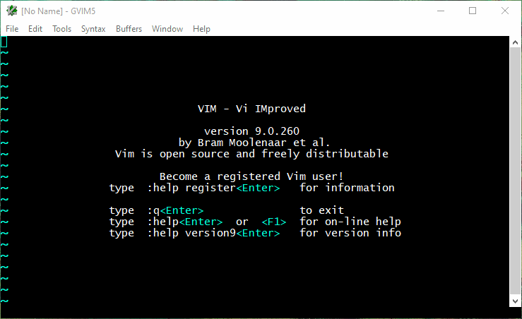
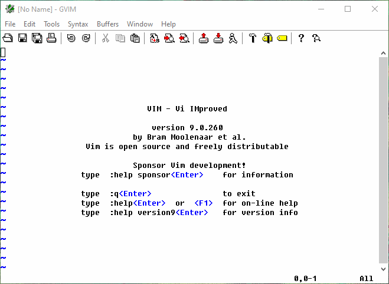

# vim setting up windows

#### 1. Buat file configurasi vim di path $HOME extensi _vimrc atau _gvimrc
- buka vim ketik :echo $HOME disitulah file configurasi vim berada
- ketik :e _gvimrc atau :e _vimrc


#### 2. Salin sumber kode dibawah ini lalu tempelkan ke file _vimrc atau _gvimrc save file tersebut
```
syntax on

set autoindent
set backspace=indent,eol,start
set clipboard=unnamed
set encoding=UTF-8
set expandtab
set fileformat=unix
set ignorecase
set incsearch
set nobackup
set nowritebackup
set nocompatible
set noswapfile
set nowrap
set shiftwidth=2
set smartindent
set smarttab
set softtabstop=2
set tabstop=2
"jika anda ingin menghapus file backup yang dibuat secara otomatis oleh vim 
"extensi file: file.txt.un~, file.js.un~ file.html.un~ 
"gunakan perintah ini:
"set undodir="C:\\Users\\USER\\vimfiles\\undodir"
set undofile
set visualbell
set ww=<,>,[,]
set completeopt-=preview
filetype plugin indent on

" untuk gui
if has("gui_running")
  set guifont=Lucida_Console:h11
  " untuk menghilangkan toolbar
  set guioptions-=T
  colorscheme koben
endif

" untuk popup text
function! OmniPopup(action)
  if pumvisible()
    if a:action == 'j'
      return "\<C-N>"
    elseif a:action == 'k'
      return "\<C-P>"
    endif
  endif
  return a:action
endfunction
inoremap <silent>j <C-R>=OmniPopup('j')<CR>
inoremap <silent>k <C-R>=OmniPopup('k')<CR>

"tab complete
function! InsertTabWrapper(direction)
  let col = col('.') - 1
  if !col || getline('.')[col - 1] !~ '\k'
    return "\<tab>"
  elseif "backward" == a:direction
    return "\<c-p>"
  else
    return "\<c-n>"
  endif
endfunction
inoremap <tab> <c-r>=InsertTabWrapper ("forward")<cr>
inoremap <s-tab> <c-r>=InsertTabWrapper ("backward")<cr>

inoremap <expr><C-J> pumvisible() ? "\<C-n>" : "\<C-J>"
inoremap <expr><C-K> pumvisible() ? "\<C-p>" : "\<C-K>"
inoremap <expr><Cr>  pumvisible() ? "\<C-y>" : "\<Cr>"
```

